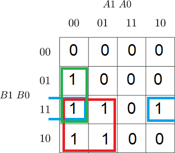
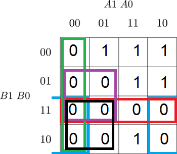

# Lab 2: Roman Szymutko
## Truth table
Truth table for 2-bit Identity comparator 
   | **Dec. equivalent** | **B[1:0]** | **A[1:0]** | **B > A** | **B == A** | **B < A** |
   | --- | --- | --- | --- | --- | --- |
   | 00 | 0 0 | 0 0 | 0 | 1 | 0 |
   | 01 | 0 0 | 0 1 | 0 | 0 | 1 |
   | 02 | 0 0 | 1 0 | 0 | 0 | 1 |
   | 03 | 0 0 | 1 1 | 0 | 0 | 1 |
   | 04 | 0 1 | 0 0 | 1 | 0 | 0 |
   | 05 | 0 1 | 0 1 | 0 | 1 | 0 |
   | 06 | 0 1 | 1 0 | 0 | 0 | 1 |
   | 07 | 0 1 | 1 1 | 0 | 0 | 1 |
   | 08 | 1 0 | 0 0 | 1 | 0 | 0 |
   | 09 | 1 0 | 0 1 | 1 | 0 | 0 |
   | 10 | 1 0 | 1 0 | 0 | 1 | 0 |
   | 11 | 1 0 | 1 1 | 0 | 0 | 1 |
   | 12 | 1 1 | 0 0 | 1 | 0 | 0 |
   | 13 | 1 1 | 0 1 | 1 | 0 | 0 |
   | 14 | 1 1 | 1 0 | 1 | 0 | 0 |
   | 15 | 1 1 | 1 1 | 0 | 1 | 0 |

### 2-bit comparator

1. Karnaugh maps for other two functions of 2-bit comparator:

   Greater than:

   

   Less than:

   

2. Mark the largest possible implicants in the K-map and according to them, write the equations of simplified SoP (Sum of the Products) form of the "greater than" function and simplified PoS (Product of the Sums) form of the "less than" function.

   

### 4-bit comparator

1. Listing of VHDL stimulus process from testbench file (`testbench.vhd`) with at least one assert (use BCD codes of your student ID digits as input combinations). Always use syntax highlighting, meaningful comments, and follow VHDL guidelines:

   Last two digits of my student ID: 240979

```vhdl
    p_stimulus : process
    begin
        -- Report a note at the beginning of stimulus process
        report "Stimulus process started";

        -- First test case ...
        s_b <= "0000"; s_a <= "0000"; wait for 100 ns;
        -- ... and its expected outputs
        assert (( s_B_greater_A = '0') and
                ( s_B_equals_A  = '1') and
                (s_B_less_A    = '0'))
        -- If true, then do not report anything
        -- If false, then report the following error
        report "Input combination b=0, a=0 FAILED" severity error;
        
         -- Second test case ...
        s_b <= "0111"; s_a <= "1001"; wait for 100 ns;
        -- ... and its expected outputs
        assert (( s_B_greater_A = '0') and
                ( s_B_equals_A  = '0') and
                (s_B_less_A    = '1'))
        -- If true, then do not report anything
        -- If false, then report the following error
        report "Input combination b=7, a=9 FAILED" severity error;
 		
         -- Third test case ...
        s_b <= "1001"; s_a <= "0111"; wait for 100 ns; -- !!! intentional mistake !!!
        -- ... and its expected outputs
        assert (( s_B_greater_A = '0') and
                ( s_B_equals_A  = '1') and
                (s_B_less_A    = '0'))
        -- If true, then do not report anything
        -- If false, then report the following error
        report "Input combination b=7, a=9 FAILED" severity error;

        -- Report a note at the end of stimulus process
        report "Stimulus process finished";
        wait; -- Data generation process is suspended forever
    end process p_stimulus;
```

2. Link to your public EDA Playground example:

   [https://www.edaplayground.com/...](https://www.edaplayground.com/...)
