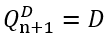
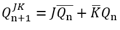
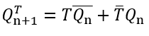
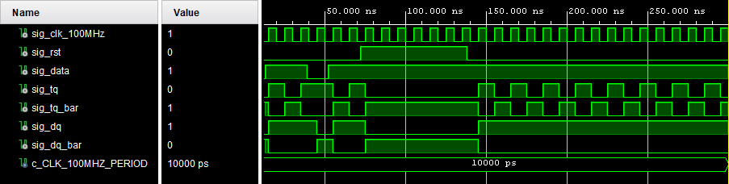
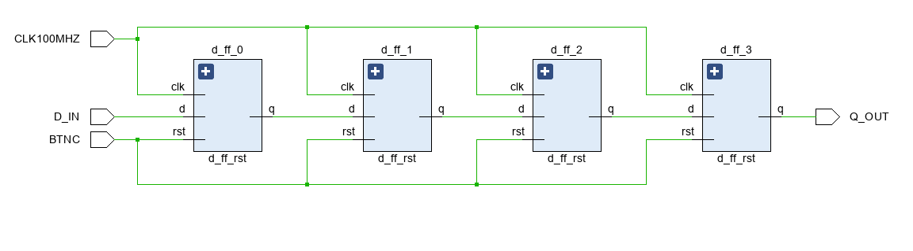

# Lab 5: Roman Szymutko
### Pre-lab preparation
 | **CLK** | **D** | **Q(n)** | **Q(n+1)** | **Comment** |
 | :-: | :-: | :-: | :-: | :-: |
 | ↑ | 0 | 0 | 0 | Q(n+1) has always same level as D when enabled by CLK edge |
 | ↑ | 0 | 1 | 0 | Q(n+1) has always same level as D when enabled by CLK edge |
 | ↑ | 1 | 0 | 1 | Q(n+1) has always same level as D when enabled by CLK edge |
 | ↑ | 1 | 1 | 1 | Q(n+1) has always same level as D when enabled by CLK edge |
 
 
 </br>
 | **CLK** | **J** | **K** | **Q(n)** | **Q(n+1)** | **Comment** |
 | :-:     | :-:   | :-:   | :-:      | :-:        | :-:         |
 | ↑ | 0 | 0 | 0 | 0 | Memory |
 | ↑ | 0 | 0 | 1 | 1 | Memory |
 | ↑ | 0 | 1 | 0 | 0 | K - Kill->0 |
 | ↑ | 0 | 1 | 1 | 0 | K - Kill->0 |
 | ↑ | 1 | 0 | 0 | 1 | J - Jump->1 |
 | ↑ | 1 | 0 | 1 | 1 | J - Jump->1 |
 | ↑ | 1 | 1 | 0 | 1 | Toggle |
 | ↑ | 1 | 1 | 1 | 0 | Toggle |

 
 </br>
 | **CLK** | **T** | **Q(n)** | **Q(n+1)** | **Comment** |
 | :-: | :-: | :-: | :-: | :-: |
 | ↑ | 0 | 0 | 0 | Memory |
 | ↑ | 0 | 1 | 1 | Memory |
 | ↑ | 1 | 0 | 1 | Toggle |
 | ↑ | 1 | 1 | 0 | Toggle |

 
 </br>
### D & T Flip-flops

1. Screenshot with simulated time waveforms. Try to simulate both D- and T-type flip-flops in a single testbench with a maximum duration of 350 ns, including reset. Always display all inputs and outputs (display the inputs at the top of the image, the outputs below them) at the appropriate time scale!

   

### JK Flip-flop

1. Listing of VHDL architecture for JK-type flip-flop. Always use syntax highlighting, meaningful comments, and follow VHDL guidelines:

```vhdl
architecture Behavioral of jk_ff is
 -- It must use this local signal instead of output ports
    -- because "out" ports cannot be read within the architecture
    signal sig_q : std_logic;
begin
    --------------------------------------------------------
    -- p_t_ff_rst:
    -- T type flip-flop with a high-active synchro reset and
    -- rising-edge clk.
    -- sig_q = t./sig_q + /t.sig_q
    -- sig_q =  sig_q if t = 0 (no change)
    -- sig_q = /sig_q if t = 1 (inversion)
    --------------------------------------------------------
    p_jk_ff : process (clk) is
    begin
        if rising_edge(clk)
        then
            if rst = '0'
            then
                if (j = '0') and (k = '1')
                then
                    sig_q <= '0';
                elsif (j = '1') and (k = '0')
                then
                    sig_q <= '1';
                elsif (j = '1') and (k = '1')
                then
                    sig_q <= not sig_q;
                else
                    sig_q <= sig_q;
                end if;
             else
             sig_q <= '0';
             end if;
        end if;
    end process p_jk_ff;

    -- Output ports are permanently connected to local signal
    q     <= sig_q;
    q_bar <= not sig_q;
end Behavioral;
```

### Shift register

1. Image of `top` level schematic of the 4-bit shift register. Use four D-type flip-flops and connect them properly. The image can be drawn on a computer or by hand. Always name all inputs, outputs, components and internal signals!

   
