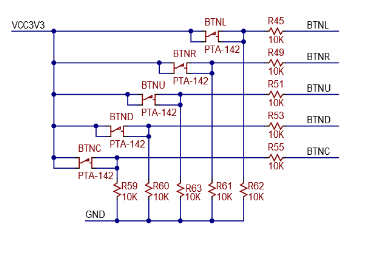
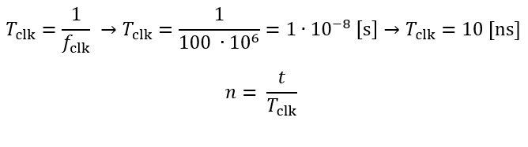
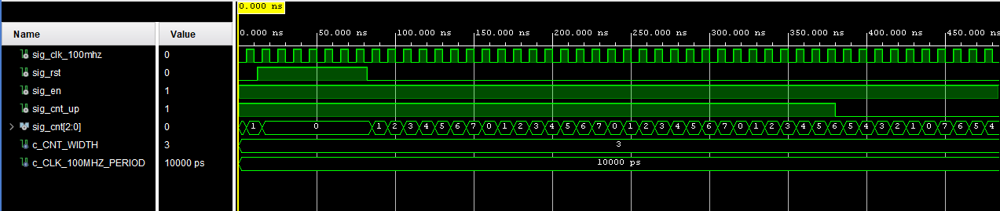
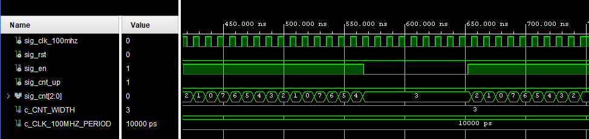
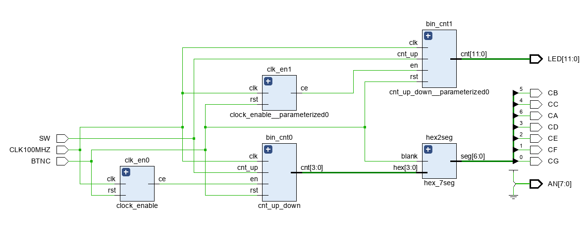

# Lab 6: Roman Szymutko
### Pre-lab preparation
 
 </br>
 Source: https://github.com/tomas-fryza/digital-electronics-1/blob/master/docs/nexys-a7-sch.pdf
 
 </br>
 | **Time interval** | **n** | **n in hex** | **n in binary**|
 | :-: | :-: | :-: | :-: |
 | 2ms | 200 000 | `x"3_0d40"` | `b"0011_0000_1101_0100_0000"` |
 | 4ms | 400 000 | `x"6_1a80"` | `b"0110_0001_1010_1000_0000"` |
 | 10ms | 1 000 000 | `x"f_4240"` | `b"1111_0100_0010_0100_0000"` |
 | 250ms | 25 000 000 | `x"17d_7840"` | `b"0001_0111_1101_0111_1000_0100_0000"` |
 | 500ms | 50 000 000 | `x"2fa_f080"` | `b"0010_1111_1010_1111_0000_1000_0000"` |
 | 1s | 100 000 000 | `x"5F5_E100"` | `b"0101_1111_0101_1110_0001_0000_0000"` |
 </br>

### Bidirectional counter

1. Listing of VHDL code of the completed process `p_cnt_up_down`. Always use syntax highlighting, meaningful comments, and follow VHDL guidelines:

```vhdl
    --------------------------------------------------------
    -- p_cnt_up_down:
    -- Clocked process with synchronous reset which implements
    -- n-bit up/down counter.
    --------------------------------------------------------
    p_cnt_up_down : process (clk) is
  begin

    if rising_edge(clk) then
      if (rst = '1') then           -- Synchronous reset
        sig_cnt <= (others => '0'); -- Clear all bits
      elsif (en = '1') then         -- Test if counter is enabled

        -- TEST COUNTER DIRECTION HERE
            if (cnt_up = '1')
            then
                sig_cnt <= sig_cnt + 1;
            else 
                sig_cnt <= sig_cnt - 1;
            end if;
      end if;
    end if;

  end process p_cnt_up_down;
```

2. Screenshot with simulated time waveforms. Test: (a) reset, (b) counter direction, (c) enable. Always display all inputs and outputs (display the inputs at the top of the image, the outputs below them) at the appropriate time scale!

   
   

### Two counters

1. Image of the top layer structure including both counters, ie a 4-bit bidirectional counter from *Part 4* and a 12-bit counter with a 10 ms time base from *Experiments on your own*. The image can be drawn on a computer or by hand. Always name all inputs, outputs, components and internal signals!

   
