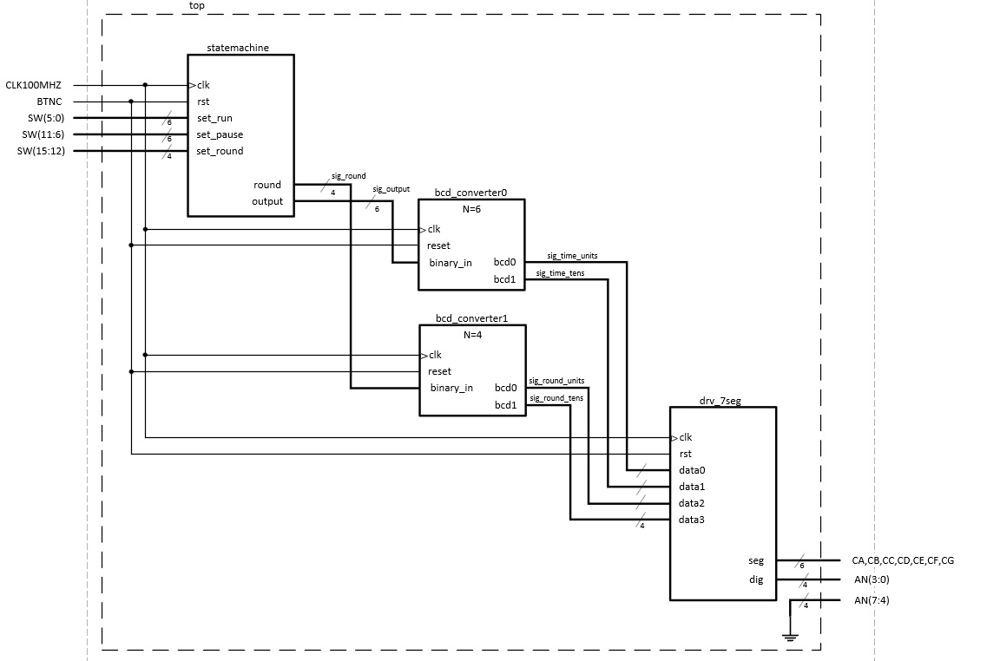
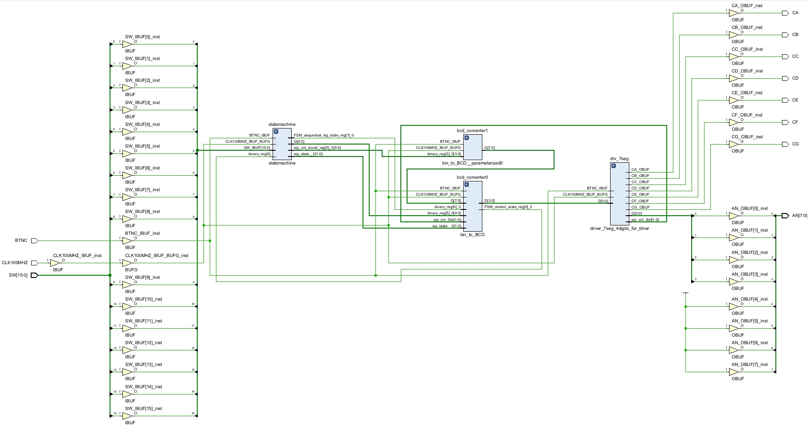
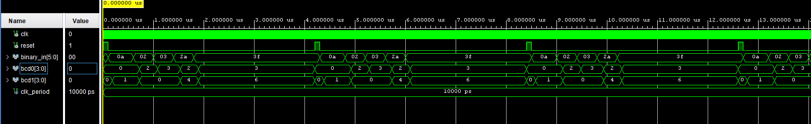
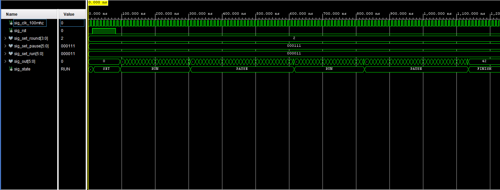
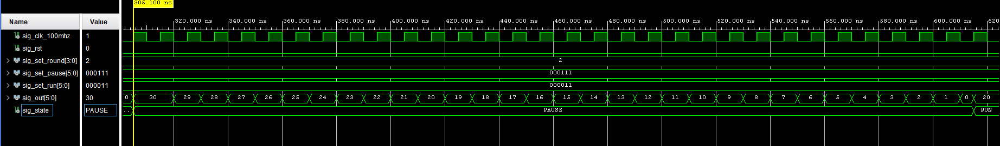
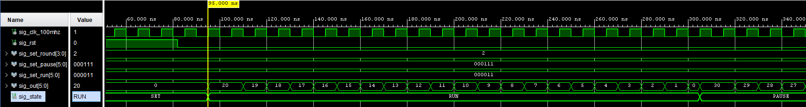
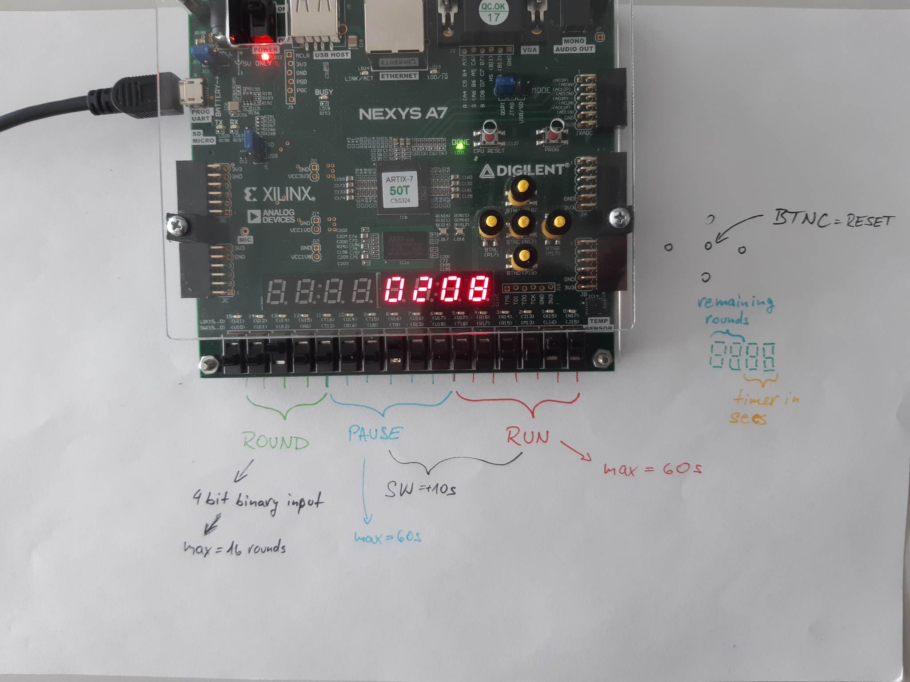

# VHDL project

### Topic

Časovač na intervalový (kruhový) trénink s možností nastavit počet kol, dobu kola a pauzy mezi nimi za běhu aplikace.

### Team members

* Roman Szymutko (responsible for construction of statemachine)
* Slávek Rylich (responsible for DBC convertor)
* Matyáš Tomeš (responsible for procokol)

## Theoretical description and explanation

Cílem projektu bylo vytvořit časovač s funkcemi nastavení času pro cvičení, pauzu a nastavení počtu kol. Celý časovač byl navržen jako stavový automat, který se přepíná mezi jednotlivými stavy SET=>RUN=>PAUSE=>(RUN<->PAUSE podle toho, kolik je nastaveno kol)=>FINISH. Díky modulu "clock_enable", který byl implementován s časovou konstantou 100000000, pracují vnitřní čítače s periodou 1s.

Ve stavu "SET" stavu se nastaví všechny údaje, jako je čas na cvičení, čas na pauzu a počet kol. Tyto údaje se nastavují současně za přídržením resetu nebo před stiskem resetu, protože automat stiskem talčítka vstupuje do stavu "SET", ve kterém zapisuje vstupní parametry do vnitřních proměnných. Po uvolnění tlačítka resetu přechází časovač do stavu "RUN" a začne se odečítat nastavená hodnota. Poté, když podteče vnitřní čítač, přechází automat do stavu "PAUSE" a od nastavené hodnoty se začíná odečítat stejným způsobem jako ve stavu "RUN".

Celý cyklus se opakuje podle toho, kolik bylo nastaveno kol ve stavu "SET". Po každém dokončení stavu "PAUSE" se odečte jedno kolo. Až se dokončí všechna kola, přechází automat do stavu "FINISH".

Zadávání hodnot času pro cvičení a pauzu je provedeno pomocí switchů. V modulu "statemachine" je implementovaná funkce, která zjistí počet aktivních switchů a vrací tuto hodnotu jako datový typ integer. Každá jednička (aktivní spínač/switch) pak představuje 10 sekund časového intervalu. Časový údaj je převáděn během výstupního procesu do formátu std_logic_vector kvůli dalšímu zpracování BCD převodníkem. Počet kol je zadáván přímo v binárním tvaru (std_logic_vector) pomocí zbývajících switchů a stejně jako časové údaje je pak předán BCD převodníku.

Modul "bit_to_BCD" využívá stavový automat k implementaci převodu. Stavový automat má tři stavy: start, shift a done. Ve stavu "start" je binární vstupní číslo načteno do binárního registru a BCD výstupní registr je nastaven na nulu. V stavu shift se binární číslo posune o jeden bit doleva a BCD výstup se aktualizuje, aby odrážel nové binární číslo. Tento proces se opakuje N-krát, kde N je počet bitů v binárním vstupním čísle. V stavu "done" je převod dokončen a stavový automat se vrací do stavu "start".

Převod z binárního kódu na BCD formát se provádí pomocí sekvence operací na výstupu BCD. Výstup BCD je rozdělen na dva čtyřbitové vektory, bcd0 a bcd1. V prvním kroku převodu se hodnota každého BCD čísla nastaví na nulu. Ve druhém kroku se binární číslo převede do BCD formátu pomocí sekvence operací sčítání a odčítání. Nakonec je BCD výstup upraven tak, aby se zajistilo, že každé číslo je v rozsahu 0 až 9.

Následně všechny výstupy z "bit_to_BCD" přivedeny na vstup "driver_7seg_4digits_for_time", který využívá převodník binárního kódu na 7segmentový display a časové multiplexování dat na jednotlivé displeje.

## Hardware description of demo application
Popis schématu: 
Vstupem obvodu jsou switche a tlačítko. Switche se zpracovávají v modulu "statemachine", tlačítko, fungující jako reset mají vechny moduly společné, stejně jako clock. 
Ze "statemachine" jsou poslány signály "sig_round" do modulu "bcd_convertor1" a "sig_output" do "bcd_converter0". 
Zde se provede převod a výstupy se předají pomocí signálů repezentující desítky a jednotky jednotlivých čísel do ovladače pro 7segmentu. 
Vstupy "data0" a "data1" ovladače využívá časovač a "data2" a "data3" počet kol. 
Výstupem jsou 4 7segmentové displeje.
Schéma obvodu:

Schéma obvodu vygenerované ve vývojovém prostředí Vivado:

## Software description
[Odkaz na testbench stavového automatu](2/2.srcs/sim_1/new/tb.vhd)
 
[Odkaz na testbench převodníku binárního kódu na BCD](project_final/project_final.srcs/sim_1/new/tb_bin_to_BCD.vhd)
 
[Odkaz na zdrojový kód stavového automatu](project_final/project_final.srcs/sources_1/new/statemachine.vhd)
 
[Odkaz na zdrojový kód převodníku binárního kódu na BCD](project_final/project_final.srcs/sources_1/new/bin_to_BCD.vhd)
 
[Odkaz na zdrojový kód 7-segmentového ovladače](project_final/project_final.srcs/sources_1/new/driver_7seg_4digits_for_timer.vhd)
 
[Odkaz na zdrojový kód top modulu](project_final/project_final.srcs/sources_1/new/top.vhd)
 

### Component(s) simulation

Na obrázku níže lze vidět situaci, kdy na vstupu převodníku se objeví binární číslo "001010", což je v desítkové soustavě 10. Na výstup se pak dostanou hodnoty bcd1 = 1 a bcd0 = 0. Když je použijeme jako jednotky a desítky, vytvoří číslo 10.
Další vstup je "000010", což je v desitkové soustavě 2. Pomocí vnitřních operací se na výstup dostanou hodnoty bcd1 = 0 a bcd0 = 2. Když z nich opět sestavíme dvouciferné číslo, vznikne hodnota 02.
Obdobně se obvod zachoval i pro vstup "000011", což je opět jednociferné číslo, tentokrát však s decimální hodnotou 3.
Vstup "101010", viditelný na simulaci jako "0x2A" a v desítkové soustavě 42, způsobí na výstupu hotnoty bcd1 = 4 a bcd0 = 2.

Na dalších obrázcích je simulace statového automatu. První obrázek ukazuje, jak se mění během chodu stavy. Na vstupu byla nastavena 2 kola, 20s cvičení a 30s přestávky.

Zde můžeme vidět odečítání hodnoty vnitřního čítače stavu "PAUSE":

Zde můžeme vidět odečítání hodnoty vnitřního čítače stavu "RUN":

## Instructions

1.Press and hold reset button 
 
2.Set time and rounds on switches
 
3.Release button
 
4.The timer has started and you can start working out

## References
[Funkce pro nalezení jedničkových bitů čísla](https://www.edaboard.com/threads/how-to-count-number-of-1s-in-std_logic_vector-vhdl.183777/)
[Převodník binárního kódu na BCD](https://allaboutfpga.com/vhdl-code-for-binary-to-bcd-converter/)
