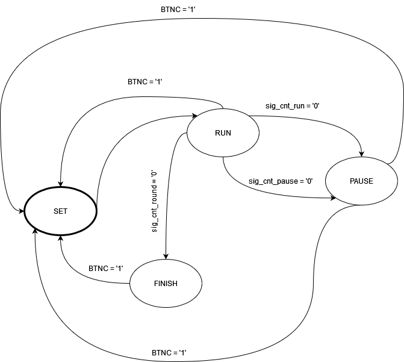

# VHDL project

### Topic

Časovač na intervalový (kruhový) trénink s možností nastavit počet kol, dobu kola a pauzy mezi nimi za běhu aplikace.

### Team members

* Roman Szymutko (responsible for construction of statemachine)
* Slávek Rylich (responsible for DBC convertor)
* Matyáš Tomeš (responsible for procokol)

## Theoretical description and explanation

Cílem tohoto pojektu bylo vytvoření časovače s možnostmi nastavení času pro cvičení, pauzy a nastavení počet kol. Celý časovač je vymyšelný na způsobu stavového automatu, 
který přepíná mezi jednotlivými stavy SET=>RUN=>PAUSE=>(RUN<->PAUSE podle toho kolik je nastaveno kol)=>FINISH. Díky clocku, který jsme zaimplementovali, jsme na každou vzestupnou hranu počítali jako jednu sekundu.
V "SET" stavu se nastaví všechny udaje jako je čas na cvičení, čas na pausu a počet kol. Tyto údaje se nastavují současně podržením s resetem, protože celý stavový automat se restatuje od znova.
Po spuštění resetu přechází do stavu "Start" a začínájí se odečítat sekundy, které se odečítaly každou náběžnou hranou clocku. Poté když číslo spadlo na "0", tak stav přešel do "PAUSE" a podle nastavené hodnoty se čas začal odečítat stejně jako u stavu "RUN".
PakPodle toho kolik bylo nastaveno kol při stavu "SET", tak se celý tento cyklu opakoval. Po každém ukočení stavu "PAUSE", se odečetlo jedno kolo. Poté co všechna kola doběhla, tak ze stavu "PAUSE" stavový automat, přešel do stavu "FINISH". 
Zadávání hodnot času pro cvičení a pro pauzu je provedeno součtem logických jedniček. Znaměná, že každá jednička reprezentuje 10 sekund.

## Hardware description of demo application

Insert descriptive text and schematic(s) of your implementation.

## Software description

Put flowchats/state diagrams of your algorithm(s) and direct links to source/testbench files in `src` and `sim` folders. 

### Component(s) simulation

Write descriptive text and simulation screenshots of your components.

## Instructions

Write an instruction manual for your application, including photos or a link to a video.

## References

1. Put here the literature references you used.
2. ...
